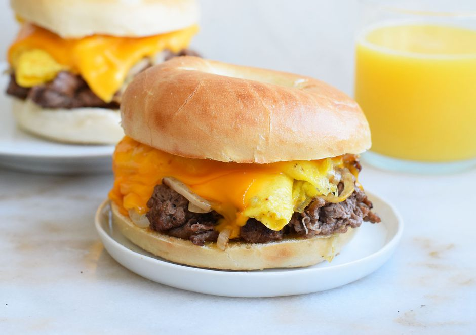

## Steak, egg, and cheese bagel (Non Vegan)

## {width="6.0in" height="4.225694444444445in"}

Pictured above is the final result of the steak, egg, and cheese bagel
recepie

**Ingredients:**

+-----------------------------------+-----------------------------------+
| 4 Tablespoons of unsalted butter  | ½ teaspoon of garlic powder       |
|                                   |                                   |
| 1 small, diced onion              | ½ teaspoon of ground black pepper |
|                                   |                                   |
| 1 tablespoon of salt              | 2 plain bagels                    |
|                                   |                                   |
| ½ lb of shaved steak              | 4 eggs                            |
|                                   |                                   |
| 1 tablespoon of Worcestershire    | 4 slices of cheese                |
| sauce                             |                                   |
+===================================+===================================+
+-----------------------------------+-----------------------------------+

**Required Cookware:**

A skillet

**Instructions:**

1.  Melt a tablespoon of butter in a skillet and add the onion and ¼
    teaspoon of salt. Cook until slightly browned

2.  Toss the shaved steak in the Worcestershire sauce, garlic powder,
    and black pepper

3.  Remove the onions, raise the heat and add the shaved steak in one
    layer

4.  Cook for 2 minutes without stirring and then stir and cook the steak
    completely

5.  Toast the bagels and spread 1 tablespoon of butter

6.  Melt two tablespoons of butter in the pan on low heat, add half of
    the eggs and cook, stirring to create an omelet

7.  Fold the omelet over on itself twice and add 2 slices of cheese

8.  Repeat the above two steps for all the eggs and cheese

9.  Divide the steak and onions among the 2 bagels and add the egg and
    cheese

## 

