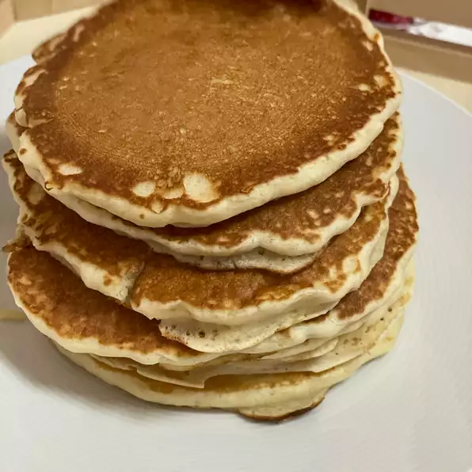

# Pancakes (non vegan)

**Pictured above is the final result of the pancakes**

## Ingredients:

- 1 ½ cups of flour               
- 1 ¼ cups of milk                  
- 3 ½ teaspoons of baking powder 
- 1 egg    
- ¼ teaspoon of salt        
- 3 tablespoons of melted butter   
- 1 tablespoon of white sugar                                              

## Required Cookware:

1 Large Bowl

1 Large spoon for stirring

1 Pan

## Directions:

1.  In the large bowl, mix the flour, baking powder, salt, and sugar.
    Pour the milk, eggs, and melted butter in the center and begin to
    stir until it reaches a smooth consistency

2.  Heat an oiled pan over medium heat. Pour 1/4^th cup of batter onto it and cook until browned on both sides.

