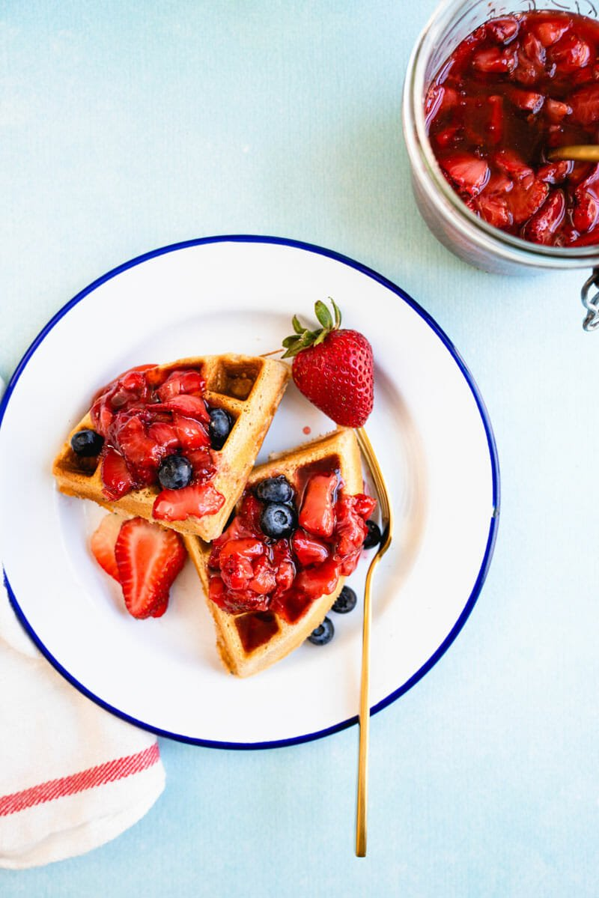

# Vegan waffles

Pictured above is the completed vegan waffles made if made in a Belgium
waffle iron

## Ingredients:
- 1 ½ cup Flour  

- 1 ½ cups Oat Milk         

- 2 teaspoons Baking Powder         

- 2 tablespoons sugar
 
- 4 tablespoons vegetable oil
 
- ½ teaspoon cinnamon
   
- 2 teaspoons vanilla
    
- ½ teaspoon salt                    

## Required Cookware:

Waffle Iron

Medium bowl

Small bowl

## Directions:

1.  Preheat the waffle iron

2.  Mix the flour, baking powder, sugar, cinnamon, and kosher salt into
    the bowl

3.  In the small bowl mix the oil, oak milk, and vanilla

4.  Pour the small bowl into the medium bowl and mix until texture is
    smooth

5.  Add this batter into the waffle iron, then cook until browned on the
    outside

